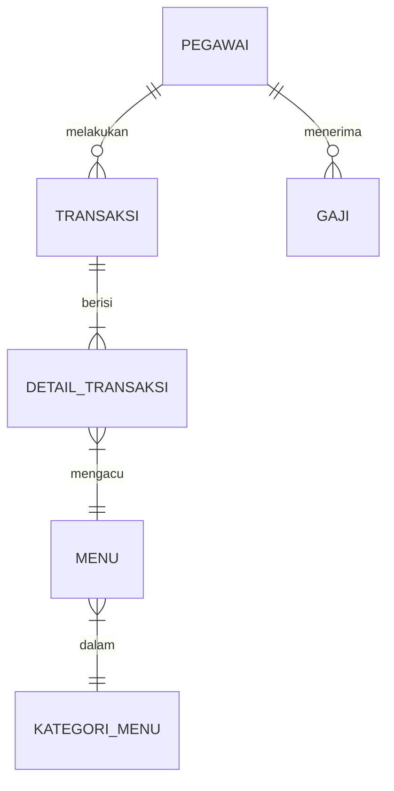
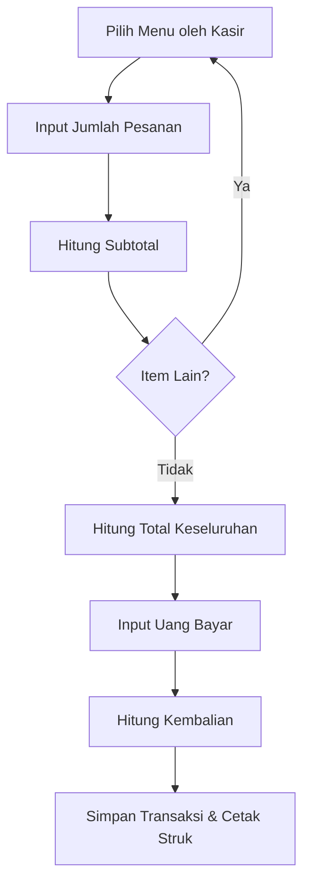
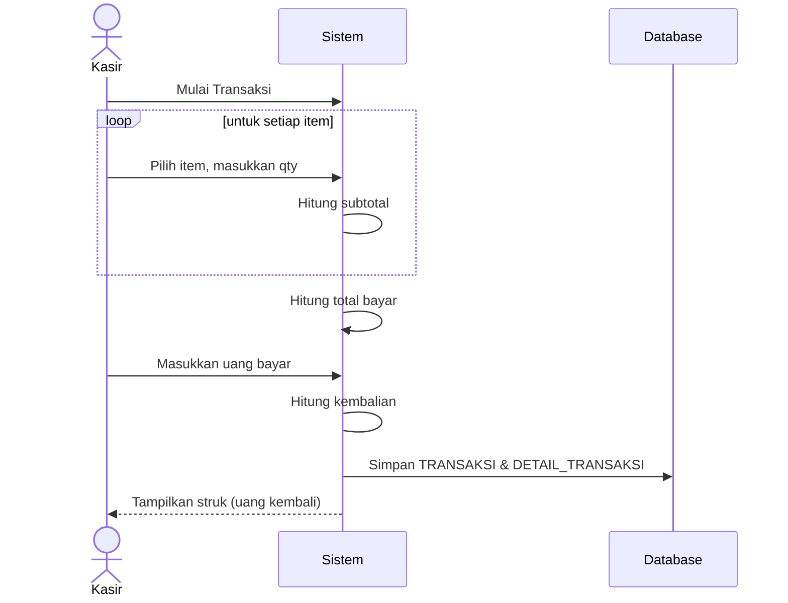
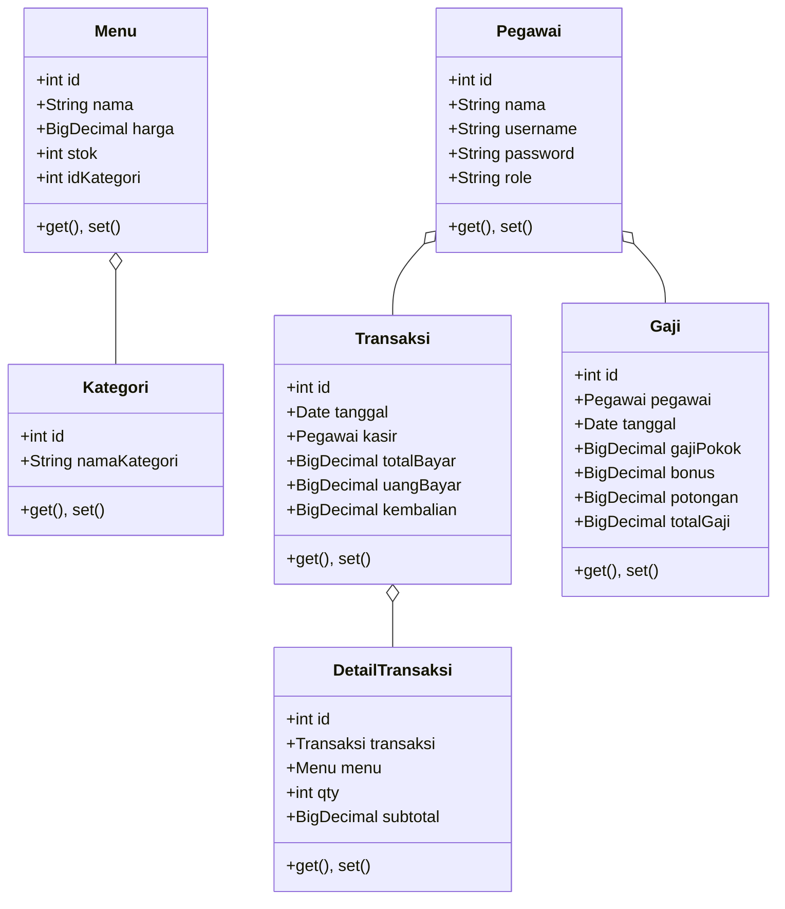

# Ringkasan Eksekutif  
Laporan ini merangkum perancangan **Sistem Kasir Kafe** berbasis desktop dengan JavaFX (via Maven) dan MySQL. Aplikasi ini mencakup modul inti: **Transaksi (Checkout)**, **Master Menu/Barang**, **Manajemen Pegawai & Gaji**, serta **Login dan Laporan**. Tim 3 orang membagi modul: kasir (transaksi), kasir data menu, manajer (pegawai/gaji). Arsitektur MVC diperkirakan, di mana *DAO* memisahkan lapisan bisnis dari lapisan data【42†L12-L16】. Basis data normalisasi InnoDB memiliki tabel: `pegawai`, `gaji`, `kategori_menu`, `menu`, `transaksi`, dan `detail_transaksi`. Dengan desain kunci primer/fungsi relasional 1-N, data dijaga integritasnya【45†L139-L145】【42†L12-L16】. UI JavaFX menggunakan teknik concurrency agar antarmuka responsif【12†L49-L58】. Deployment menggunakan Maven (struktur standar), dependensi JavaFX dan MySQL Connector. Backup data disarankan memakai `mysqldump` rutin【39†L139-L147】. Dokumen ini berisi skema ERD, diagram UML (Use-Case, Aktivitas, Sekuens, Kelas), mockup form (Login, Menu, Transaksi, Gaji, Laporan), rancangan API/DAO (signatur metode, query SQL), strategi deploy (Maven pom, properties, skrip SQL), serta checklist pengujian dan agenda tim. Semua asumsi (misalnya mata uang, tabel relasi tambahan) dijelaskan. 

## Ruang Lingkup dan Asumsi  
Sistem fokus sebagai *Point-of-Sale* (POS) sederhana untuk kafe kecil. Fitur kunci: manajemen data menu (CRUD), proses transaksi kasir (order–pembayaran–kembali–struk), manajemen pegawai/gaji, dan laporan penjualan. **Batasan**: hanya satu pegawai kasir dan satu owner (tanpa fitur tambah/hapus user dinamis). Pelanggan tak disimpan sebagai entitas, cukup catatan ciri-ciri (mis. “berjaket merah”) untuk pengiriman pesanan. Asumsi:  
- **Mata Uang**: Rupiah (Rp).  
- **Tanggal/Waktu**: Format `DATE` (MySQL) untuk tanggal transaksi/gaji, `DATETIME` jika perlu cap waktu.  
- **Stok & Harga**: Menggunakan tipe numerik (`INT` untuk stok, `DECIMAL(12,2)` untuk harga).  
- **Restriksi Sistem**: Sistem berjalan offline lokal; backup manual.  
- **Skala**: Data tidak besar, InnoDB default sudah memadai (ACID, FK)【14†L438-L446】.  

## Desain Basis Data  

### Entitas dan Skema Tabel  
Tabel utama beserta atribut dan tipe (contoh):  

- **pegawai** (id_pegawai INT PK, nama VARCHAR, username VARCHAR UNIQUE, password VARCHAR, role ENUM(‘kasir’,‘owner’)).  
- **kategori_menu** (id_kategori INT PK, nama VARCHAR).  
- **menu** (id_menu INT PK, id_kategori INT FK→kategori_menu, nama VARCHAR, harga DECIMAL, stok INT).  
- **transaksi** (id_transaksi INT PK, tanggal DATETIME, id_pegawai INT FK→pegawai, total_bayar DECIMAL, uang_bayar DECIMAL, kembalian DECIMAL, catatan VARCHAR).  
- **detail_transaksi** (id_detail INT PK, id_transaksi INT FK→transaksi, id_menu INT FK→menu, qty INT, subtotal DECIMAL).  
- **gaji** (id_gaji INT PK, id_pegawai INT FK→pegawai, tanggal DATE, gaji_pokok DECIMAL, bonus DECIMAL, potongan DECIMAL, total_gaji DECIMAL).  

Setiap PK INT auto-increment. Kunci luar (FK) dijaga konsistensi referensial (ON UPDATE/DELETE CASCADE/SET NULL sesuai kebijakan). Index disarankan pada kolom pencarian umum (mis. nama_menu, tanggal_transaksi). Konstraint UNIQUE pada username pegawai. Normalisasi hingga 3NF: pisahkan kategori, hindari duplikasi【45†L214-L223】.  

### Relasi dan Kardinalitas (ERD)  
Relasi utama (1-N):  
- Satu `kategori_menu` dapat dimiliki banyak `menu`. Satu `menu` hanya pada satu kategori【45†L139-L145】.  
- Satu `pegawai` (kasir) dapat melakukan banyak `transaksi`.  
- Satu `transaksi` terdiri dari banyak `detail_transaksi` (setiap baris mengacu ke satu `menu`).  
- Satu `pegawai` bisa memiliki banyak entri `gaji`.  

Dalam ERD:  

Setiap entitas direpresentasi dengan atribut-atribut utamanya. Cara ini memudahkan visualisasi struktur data【45†L139-L145】【42†L12-L16】. 

## Diagram UML dan Model

### Diagram Use Case  
Pelaku: **Owner**, **Kasir**. Use case utama:
- Login (kasir/owner masuk sistem).  
- **Owner**: Lihat/Laporkan penjualan, manage data gaji pegawai.  
- **Kasir**: CRUD Menu, proses Transaksi (Pilih pesanan, input bayar, cetak struk).  
- Use case diagram dapat ditulis sebagai daftar atau diagram sederhana. Contoh (mermaid tidak mendukung use-case natively, definisi tekstual):  

```
Actors: Kasir, Owner
Use Cases:
  Kasir: [Login, Kelola Menu, Proses Transaksi, Cetak Struk]
  Owner: [Login, Lihat Laporan, Kelola Gaji]
Kasir -> Login
Kasir -> Kelola Menu
Kasir -> Proses Transaksi
Kasir -> Cetak Struk
Owner -> Login
Owner -> Lihat Laporan
Owner -> Kelola Gaji
```

### Diagram Aktivitas (Transaksi)  
Alur transaksi:  
1. **Pilih Menu**: Kasir memilih item dari daftar menu (tabel Menu).  
2. **Input Jumlah**: Masukan kuantitas; sistem hitung subtotal (`qty * harga`).  
3. **Hitung Total**: Sistem menjumlahkan subtotal semua item (loop).  
4. **Pembayaran**: Kasir masukkan uang bayar; sistem hitung kembalian (`bayar - total`).  
5. **Simpan & Cetak**: Simpan `transaksi` dan `detail_transaksi`, cetak struk.  

Mermaid flowchart untuk aktivitas:  


### Diagram Sekuens (Checkout)  
Contoh skenario: Kasir menjalankan transaksi.  

Diagram ini menyiratkan siklus transaksi dan interaksi Kasir–Sistem–Database (DAO).

### Diagram Kelas (Core)  
Kelas model utama: `Menu`, `Kategori`, `Pegawai`, `Transaksi`, `DetailTransaksi`, `Gaji`. Kelas `DAO` untuk tiap entitas (mis. `MenuDAO`). Contoh mermaid class:  

Diagram kelas ini menunjukkan properti utama dan relasi antar kelas. `DAO` bukan ditampilkan di sini, namun setiap kelas model akan memiliki DAO terkait (mis. `TransaksiDAO` dengan metode CRUD).

## Mockup Antarmuka (UI)  
Desain form utama (groff layout) dengan validasi sederhana:

- **Form Login**: Field *Username* (wajib), *Password* (wajib). Tombol *Login*. Validasi: tak boleh kosong.  
- **Form Menu (CRUD)**: Tabel daftar menu, tombol *Tambah*, *Edit*, *Hapus*. Form tambah/edit: **Nama**, **Kategori** (dropdown), **Harga**, **Stok**. Validasi: nama & kategori wajib; harga/stok numerik >0.  
- **Form Transaksi/Checkout**: Daftar menu (checkbox atau multi-select) dengan kolom *Qty*. Kolom *Subtotal* ter-hitung dinamis. Field *Total*, *Uang Bayar* (input numeric), *Kembalian* (otomatis). Tombol *Simpan/Cetak*. Validasi: qty ≥1, uang bayar ≥ total.  
- **Form Gaji**: Tabel histori gaji. Tombol *Tambah Gaji*. Form: *Pilih Pegawai* (combo), *Gaji Pokok*, *Bonus*, *Potongan*. *Total Gaji* dihitung (`pokok+bonus-potongan`). Validasi: numeric.  
- **Form Pegawai**: (Jika ada) Tabel pegawai (admin hanya). CRUD data pegawai (walau disederhanakan jadi 2 akun).  
- **Laporan**: Tampilkan ringkasan penjualan harian/mingguan sebagai tabel atau grafik sederhana. Validasi: periode (tanggal) valid.  
Setiap form mengikuti layout desktop standar (menu bar atas, form di tengah). Mockup sebaiknya dibuat dengan *SceneBuilder* atau tool wireframe; berikut detail fieldnya.

## Rancangan DAO/API  
Setiap entitas punya DAO (mis. `MenuDAO`, `TransaksiDAO`, dll.) dengan metode CRUD. Contoh metode `TransaksiDAO`:  
```java
public interface TransaksiDAO {
    void save(Transaksi t) throws SQLException;
    Transaksi get(int id) throws SQLException;
    List<Transaksi> getAll() throws SQLException;
    void update(Transaksi t) throws SQLException;
    void delete(int id) throws SQLException;
}
```
Implementasi DAO menggunakan JDBC. Contoh SQL untuk `save`:  
```sql
INSERT INTO transaksi (tanggal, id_pegawai, total_bayar, uang_bayar, kembalian, catatan)
VALUES (?, ?, ?, ?, ?, ?);
```
```
INSERT INTO detail_transaksi (id_transaksi, id_menu, qty, subtotal) VALUES (?, ?, ?, ?);
```
Gunakan **transaksi database** agar kedua tabel tersimpan atomik (auto-commit = false, lalu commit/rollback)【14†L438-L446】【39†L139-L147】. Handle `PreparedStatement` dan `ResultSet` dengan *try-with-resources* untuk menghindari kebocoran resource. Perhatikan `synchronized` atau pool koneksi jika akses bersamaan (selama satu client, risiko kecil).  

Metode lain: `MenuDAO.getAll()` (`SELECT * FROM menu`), `GajiDAO.save()`, dsb. Penting: validasi di lapisan service/DAO (hindari SQL injection, gunakan parameter). Concurrency di DB dikelola InnoDB (default REPEATABLE READ)【14†L438-L446】, konflik jarang pada sistem lokal kecil.  

## Catatan Deployment  
- **Struktur Maven**: Gunakan layout standar:  
  - `src/main/java` (kode), `src/main/resources` (fxml/CSS, `application.properties`), `src/test` (tes).  
- **Dependensi (pom.xml)**:  
  - *JavaFX SDK* (via Maven Central, e.g. `org.openjfx:javafx-controls:17`),  
  - *MySQL Connector/J* (`mysql:mysql-connector-java`),  
  - *JFoenix* (opsional UI), *JUnit* untuk testing, dll.  
- **File aplikasi**: `application.properties` contoh:  
  ```
  db.url=jdbc:mysql://localhost:3306/kafe
  db.user=root
  db.pass=password
  ```
- **Setup MySQL**:  
  - Buat database `kafe` (atau via script `CREATE DATABASE kafe;`).  
  - Skrip tabel (contoh):  
    ```sql
    CREATE TABLE pegawai (
      id_pegawai INT AUTO_INCREMENT PRIMARY KEY,
      nama VARCHAR(100) NOT NULL,
      username VARCHAR(50) UNIQUE NOT NULL,
      password VARCHAR(100) NOT NULL,
      role ENUM('kasir','owner') NOT NULL
    );
    CREATE TABLE kategori_menu (...);
    CREATE TABLE menu (..., FOREIGN KEY (id_kategori) REFERENCES kategori_menu(id_kategori));
    CREATE TABLE transaksi (..., FOREIGN KEY (id_pegawai) REFERENCES pegawai(id_pegawai));
    CREATE TABLE detail_transaksi (...,
       FOREIGN KEY (id_transaksi) REFERENCES transaksi(id_transaksi),
       FOREIGN KEY (id_menu) REFERENCES menu(id_menu));
    CREATE TABLE gaji (..., FOREIGN KEY (id_pegawai) REFERENCES pegawai(id_pegawai));
    ```  
  - Insert akun default (kasir, owner).  
- **Backup**: Rutin ekspor dengan `mysqldump`【39†L139-L147】, misalnya:  
  ```
  mysqldump -u root -p kafe > backup_kafe_$(date +%F).sql
  ```  
  Simpan beberapa backup; restore dengan `mysql` ketika perlu.  

## Pengujian  
**Checklist Pengujian**:  
- Login: username/password valid/invalid.  
- Menu CRUD: tambah data, ubah harga, hapus (cek integritas relasi).  
- Transaksi: akumulasi subtotal benar, total cocok, kembalian dihitung. Uji kasus *uang bayar kurang* harus tolak. Struk tercetak sesuai data.  
- Data Gaji: simpan dan cek perhitungan `total_gaji = pokok+bonus-potongan`. Tes limit (tanpa potongan).  
- Laporan: periode benar, data sesuai total transaksi.  
- Stress (opsional): dua transaksi simultan (cek tidak crash).  

**Contoh Kasus Uji**:  
1. **Tambah Menu**: nama="Es Teh", harga=5000, stok=50. Cek di DB: entry muncul (5000,50).  
2. **Transaksi**: Pilih "Es Teh" qty=2, total 10000. Input bayar=15000, kembalian=5000. Cek DB: `transaksi.total_bayar=10000`, `kembalian=5000`; `detail_transaksi` qty=2.  
3. **Gaji**: Gaji pokok=Rp5.000.000, bonus=500.000, potongan=100.000, total=5.400.000.  

Pengujian unit: dapat menggunakan JUnit untuk DAO (uji CRUD), TestFX untuk GUI interaksi (simulasi klik, input)【47†L46-L53】.  

## Tugas dan Jadwal Tim  
| Anggota  | Modul Utama              | Tugas Kunci                    |
|----------|--------------------------|-------------------------------|
| Anggota A (kasir) | *Transaksi/Checkout*    | UI Checkout, DAO Transaksi, validasi pembayaran  |
| Anggota B (kasir) | *Menu/Barang*           | UI Menu CRUD, DAO Menu, kategori menu |
| Anggota C (owner) | *Pegawai + Gaji*        | UI Gaji & Pegawai, DAO Pegawai & Gaji |

**Timeline (Gantt sederhana)**:
- **Minggu 1**: Analisis kebutuhan, perancangan DB/ERD.  
- **Minggu 2**: Desain UI mockup, skema API/DAO.  
- **Minggu 3-4**: Implementasi modul terpisah (Transaksi; Menu; Pegawai/Gaji).  
- **Minggu 5**: Integrasi modul, pengerjaan Login & Laporan.  
- **Minggu 6**: Pengujian dan debugging.  
- **Minggu 7**: Dokumentasi akhir, persiapan presentasi.  

**Agenda Pertemuan Tim**:
1. **Review Desain**: Tampilkan ERD, UML, mockup UI. Pastikan semua sepaham skema tabel dan alur transaksi.  
2. **Pembagian Tugas Detil**: Verifikasi modul person-in-charge; rincian fitur per anggota.  
3. **Koordinasi Integrasi**: Rencanakan titik sinkronisasi modul (mis. join session pada GIT).  
4. **Tes Awal**: Tentukan kasus uji dasar, siapkan skrip dummy.  
5. **Kebutuhan Infrastruktur**: Pastikan lingkungan dev (IDE, DB) siap untuk semua.  
6. **Backup & Kontrol Versi**: Atur repositori Git, tentukan jadwal commit/backup data.  

Dengan rancangan ini, tim siap membangun *prototype* POS JavaFX yang kokoh, dengan standar baik (mis. DAO pattern【42†L12-L16】, transaksi DB atomik, responsif UI【12†L49-L58】, backup data aman【39†L139-L147】). Untuk referensi lebih lanjut, gunakan dokumen resmi MySQL dan JavaFX【47†L18-L27】【39†L139-L147】 serta artikel desain DB【45†L214-L223】. 

